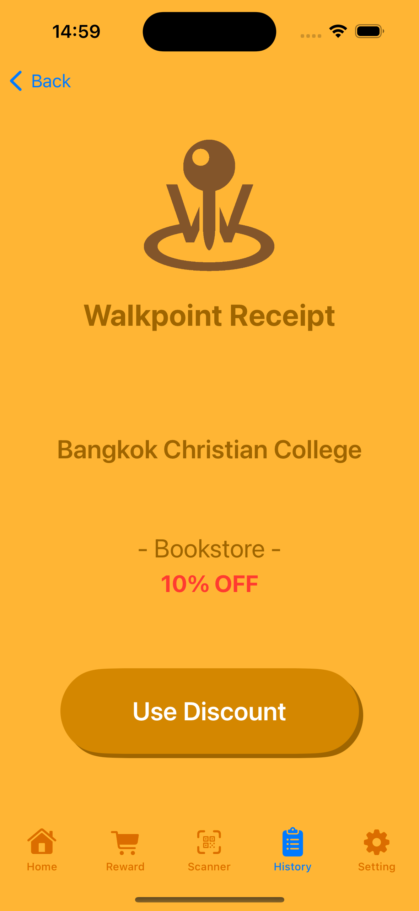

# Walkpoint

### What is Walkpoint?
**Walkpoint** is the application that was written with Swift in Swift Hackathon 1st. My team name is Prakapongsamphorcure it means "Canned fish with three chefs", Opek Sitthinon, Kik Attichet, Kim Pranchayut and Teacher Nattee. Objective of this application is to decrease the number of people using elevators and other forms of transportation to save electricity and fossil fuels by walking.
   
**Walkpoint** คือแอปพลิเคชันที่เขียนด้วย Swift ในงาน Swift Hackathon 1st โดยมีชื่อทีมว่า "ปลากระป๋องสามพ่อครัว" และมีสมาชิคได้แก่ได้แก่ Opek Sitthinon, Kik Attichet, Kim Pranchayut และ ครูที่ปร฿กษา Mr.Nattee โดยวัตถุประสงค์ของแอปพลิเคชันนี้คือเพื่อลดจำนวนคนที่ใช้ลิฟต์หรือการเดินทางรูปแบบอื่นๆที่ใช้พลังงาน เพื่อประหยัดไฟฟ้าและเชื้อเพลิงฟอสซิลด้วยการเดิน
 
 
 
### Method
This application let organizations or anyone can create a QR code and put it anywhere so the user can scan and get a token for buying tickets that the group owner puts it in. Now it might seem unfair for group owner to reduce costs without any benefits, right? But what if we put a QR code on the staircases or footpaths for pedestrians.Now we save resources, and those money that owner no loss at it, so we let organizations turn that money into tickets. 
   
แอปพลิเคชันนี้ช่วยให้องค์กรหรือใครก็ตามสามารถสร้าง QR Code เพื่อวางไว้ที่ใดก็ได้เพื่อให้ผู้ใช้สามารถสแกนและรับ Token สำหรับการซื้อส่วนลดต่างที่เจ้าของกลุ่มจัดตั้งมันขึ้นมา ซึ่งอาจดูไม่ยุติธรรมเลยที่เจ้าของกลุ่มจะลดต้นทุนโดยไม่ได้รับผลประโยชน์ใดๆใช่ไหม? แต่จะเกิดอะไรขึ้นหากเราแปะ QR Code ไว้บนบันไดหรือทางเท้า ซึ่งทั้งหมดที่กล่าวมาประหยัดทรัพยากร และทรัพยากรเหล่านั้นเจ้าของกลุ่มจะได้ไม่เสียเงิน เราจึงให้เจ้าของกลุ่มเปลี่ยนเงินนั้นให้เป็นส่วนลดได้ 
 
 
 

### Used Language/Tools

  &nbsp;

   

I let you guys see the interface so it might make you guys better understand the method, but this is just prototype It might have a good frontend, but lots of the backend is not finished yet.

### Flowchart 

  

   

### Application Page Interface (XCode Simulator)

  
  
  
  
  
  

### Application Page Usage (XCode Simulator)

  
  
  

