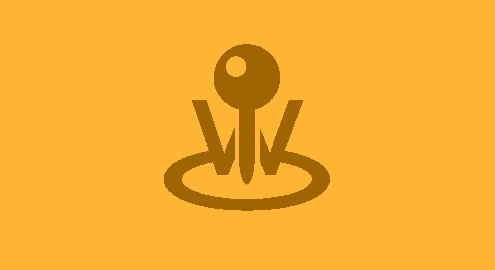
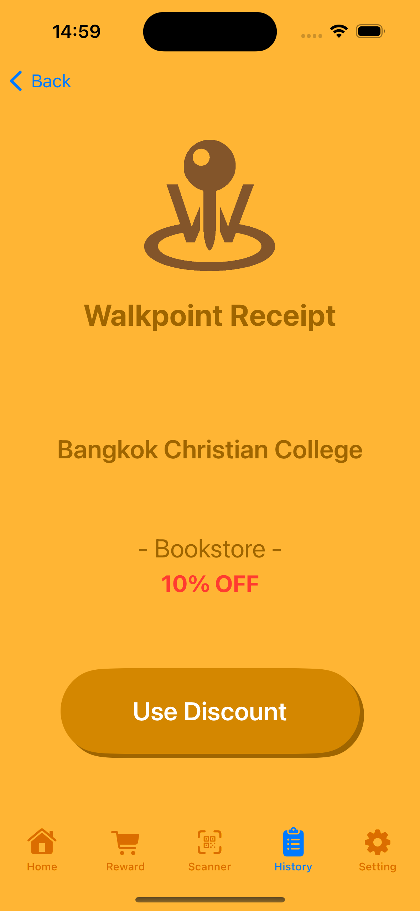

# 🚶 Walkpoint

  

  
  
  

---

## ✨ Overview

Walkpoint is a prototype mobile application developed during the **1st Swift Hackathon** using Swift.

The project was created by **Team Prakapongsamphorcure (ปลากระป๋องสามพ่อครัว)**, consisting of (Opek) Sitthinon, (Kik) Attichet, (Kim) Pranchayut, and our advisor **Mr. Nattee**.

Walkpoint encourages people to choose walking over elevators or other short-distance transportation methods by rewarding environmentally friendly behavior. The goal is to reduce electricity consumption and fossil fuel usage while promoting healthier daily habits.

## 💡 How It Works

Instead of simply rewarding purchases, Walkpoint rewards movement.

Organizations can create QR codes and place them at locations where they want to encourage walking, such as:

* Staircases
* Walkways
* Campus paths
* Office buildings
* Public spaces

Users scan these QR codes to earn **Walk Tokens**, which can later be redeemed for rewards provided by the organization.

This creates a win-win system:

* 🚶 Users receive rewards for choosing healthier and greener transportation.
* 🏢 Organizations encourage sustainable behavior.
* 🌱 Less elevator usage means lower electricity consumption and reduced environmental impact.

## 🚀 Features

| Feature                | Description                                                                |
| ---------------------- | -------------------------------------------------------------------------- |
| **QR Code Check-ins**  | Scan QR codes placed at designated walking locations to earn tokens.       |
| **Reward System**      | Exchange collected tokens for coupons or rewards offered by organizations. |
| **Walking Incentives** | Encourage users to take stairs and walk instead of using elevators.        |
| **Reward History**     | View redeemed rewards and transaction history.                             |
| **QR Scanner**         | Built-in QR code scanner for fast and simple check-ins.                    |

## 🌱 Future Improvements

| Planned Feature               | Description                                                                 |
| ----------------------------- | --------------------------------------------------------------------------- |
| **GPS Verification**          | Prevent QR code abuse by verifying user location.                           |
| **Health Integration**        | Connect with Apple Health to reward actual walking distance and steps.      |
| **Leaderboards**              | Friendly competitions between schools, offices, or organizations.           |
| **Analytics Dashboard**       | Allow organizations to measure participation and environmental impact.      |
| **Native Reward Marketplace** | Enable businesses to create and manage rewards directly in the application. |

## 🛠 Built With

<table>
<tr align="center">
<td width="120">

</td>

<td width="120">

</td>
</tr>

<tr align="center">
<td>Swift</td>
<td>Xcode</td>
</tr>
</table>

## 📸 Screenshots

<table>
<tr>
<td align="center">

 <b>Home</b>
</td>

<td align="center">

 <b>Rewards</b>
</td>

<td align="center">

 <b>QR Scanner</b>
</td>
</tr>
</table>

<table>
<tr>
<td align="center">

 <b>History</b>
</td>

<td align="center">

 <b>Settings</b>
</td>

<td align="center">

 <b>Receipt</b>
</td>
</tr>
</table>

## 🎬 Prototype Flow

<table>
<tr>
<td align="center">

 <b>Successful Check-in</b>
</td>

<td align="center">

 <b>Reward Redemption</b>
</td>

<td align="center">

 <b>Failed Redemption</b>
</td>
</tr>
</table>

## 🏆 Hackathon

This project was developed during the **1st Swift Hackathon** as a proof-of-concept demonstrating how technology can encourage sustainable transportation through positive incentives.

## 📄 License

This project is shared for educational and portfolio purposes.
